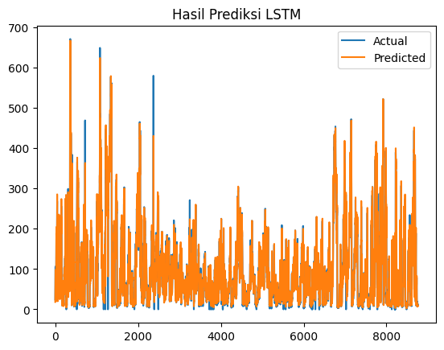

# 📈 LSTM Time Series Forecasting (Multivariate)

Proyek ini adalah implementasi **Jaringan Syaraf Tiruan (JST)** menggunakan arsitektur **LSTM (Long Short-Term Memory)** untuk memprediksi nilai waktu ke depan berdasarkan data multivariate. Data yang digunakan berasal dari file `LSTM-Multivariate_pollution.csv`.

---

## 🧠 Model Arsitektur

Model LSTM yang digunakan terdiri dari beberapa layer:

- `LSTM(50, return_sequences=True)` - LSTM pertama
- `Dropout(0.2)` - untuk mengurangi overfitting
- `LSTM(30)` - LSTM hidden layer tambahan
- `Dropout(0.2)`
- `Dense(1)` - output layer memprediksi satu nilai

---

## ⚙️ Langkah-Langkah

1. **Preprocessing Data**
   - Menghapus kolom non-numerik
   - Normalisasi dengan `MinMaxScaler`
   - Ubah data ke bentuk time series supervised learning

2. **Modeling**
   - Membangun model LSTM dengan Keras
   - Latih model dengan data training
   - Validasi dengan data test

3. **Visualisasi**
   - Membandingkan hasil prediksi vs data aktual

---

## 🖼️ Hasil Prediksi

Berikut adalah hasil prediksi LSTM dibandingkan dengan data aktual:

---

## 📚 Dependensi

- Python 3.x
- Pandas
- NumPy
- Scikit-learn
- TensorFlow / Keras
- Matplotlib

---

## 📁 Dataset

Nama file: `LSTM-Multivariate_pollution.csv`

---

## 👨‍💻 Dibuat oleh

Ilham Tatayo Lie  
Tugas: Jaringan Syaraf Tiruan (LSTM)  
Google Colab Project  
